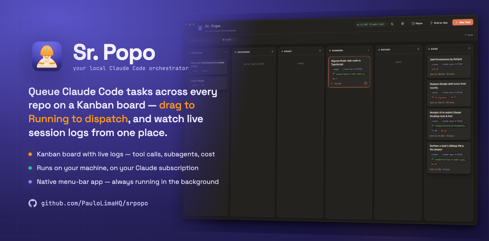

<div align="center">



# 🧞 Sr. Popo

**Run many Claude Code sessions in parallel — from one calm Kanban board.**

Queue prompts against your own git repos, drag them to **Running** to dispatch, and
watch each `claude` CLI session stream live: tool calls, subagents, cost, and the
final diff. It runs entirely on your machine and drives your existing **Claude
subscription** — never an API key.

[](https://github.com/PauloLimaHQ/srpopo/releases/latest)
[](https://github.com/PauloLimaHQ/srpopo/actions/workflows/ci.yml)
[](./LICENSE)


</div>

## Download

Grab the latest installer from the **[Releases page →](https://github.com/PauloLimaHQ/srpopo/releases/latest)**

| Platform | File |
|---|---|
| **macOS** (Apple Silicon + Intel) | `Sr.Popo-*.dmg` |
| **Windows** (x64) | `Sr.Popo-Setup-*.exe` |

Builds are **unsigned** for now, so your OS will warn on first launch:

- **macOS** — right-click the app → **Open** to bypass Gatekeeper (once).
- **Windows** — on the SmartScreen prompt, choose **More info → Run anyway**.

> **Prefer to run from source?** See [Develop](#develop) below.

### Before you start

You need the **[Claude Code CLI](https://claude.com/claude-code)** installed and
logged in — Sr. Popo drives it. Check with:

```bash
claude --version   # must be on your PATH
```

That's it. On first launch, open **📁 Repos**, add a local git repository, and you're
ready to queue a task.

## What it is

Sr. Popo is a **local orchestrator hub for Claude Code**. Instead of babysitting one
terminal at a time, you line up prompts on a board, dispatch as many as you like, and
review the results calmly — each one an independent, isolated `claude` session.

It's a native **macOS/Windows desktop app** (Electron) that lives in your **menu bar /
tray** — click the lamp icon to show or hide the board; it keeps your tasks running in
the background when the window is closed.

## Features

- **Kanban board** — `Backlog → Ready → Running → Review → Done`, drag a card to
  Running to dispatch.
- **Live session stream** — every prompt, assistant message, and tool call with
  input/output, **subagents** grouped and tracked live, plus duration, turns, and cost.
- **Runs in parallel** — dispatch many tasks at once; each is its own `claude` process.
- **Your subscription, not an API key** — `ANTHROPIC_API_KEY` is stripped from every
  spawned task, so runs always use your Claude login.
- **Isolated worktrees** — optionally run each task on its own `srpopo/<slug>` branch in
  a dedicated git worktree, so parallel work never collides.
- **Ask-before-running permissions** — a task can prompt you (Allow / Deny) before it
  runs any tool it wasn't pre-authorized for, instead of silently failing.
- **Add-ons** — opt-in per-task behaviors like *self code review* and *open a PR*
  (`gh pr create`) at the end of a run.
- **Brief an Idea** — hand it a rough idea; a read-only grooming session explores the
  repo and rewrites it into a well-formed, self-contained task prompt.
- **Follow-ups** — finished tasks keep their session; type in the composer to resume
  with full context (`claude --resume`).
- **GitHub PRs in the drawer** — surfaces a task's pull request when there is one.
- **MCP server** — while Sr. Popo runs it exposes its board over MCP (Streamable HTTP
  at `/mcp`), so another Claude Code session can list, queue, dispatch, and stop tasks.
- **Light & dark theming**, native OS notifications, and an inline SVG icon set (no
  icon font, no network fetch).
- **Local-first & dependency-light** — binds `127.0.0.1` only, data stays per-user on
  your machine, and `express` is the only runtime dependency (no frontend framework).

## How it works

1. **📁 Repos** — register the local git repositories you work in.
2. **＋ New Task** — pick a repo, write the prompt, and choose:
   - **Model** — account default / sonnet / opus / haiku / fable
   - **Permissions** — `acceptEdits` (recommended), bypass-all, or plan-only
   - **Worktree** — run isolated on branch `srpopo/<task>`
3. **Dispatch** — drag the card into **Running** (or hit *Create & Run*). Sr. Popo
   spawns `claude -p --output-format stream-json` in the repo/worktree and streams
   everything live.
4. **Review** — successful runs land in **Review**; failures show there with a red
   badge. Click any card for the full session timeline and final cost/turns.
5. **Follow-up** — resume a finished task from the composer, or drag it back to Running.
6. **Done** — when you're happy, drag to Done, then *Remove worktree* / *Archive*. Merge
   the `srpopo/*` branch however you normally would.

## Drive it from another agent (MCP)

While Sr. Popo is running it doubles as an **MCP server**, so a separate Claude Code
session (or any MCP client) can drive the board — list repos, queue a task, dispatch
it, and stop a run — through the same code paths the UI uses. It speaks MCP's
Streamable HTTP transport at `/mcp`:

```bash
claude mcp add --transport http srpopo http://127.0.0.1:7777/mcp
```

Tools: `list_repos`, `list_tasks`, `get_task`, `create_task`, `dispatch_task`,
`stop_task`. Like the rest of the app it has no auth and binds `127.0.0.1` only —
that localhost binding is the security boundary, so keep it local.

## Develop

Requirements: **Node.js 18+**, **git**, and the Claude Code CLI (above).

```bash
npm install
npm start          # compiles TypeScript (tsc), then launches the Electron app (port 7777 in dev)
```

Run the plain web server instead of the desktop shell — this runs the TypeScript
directly with [`tsx`](https://tsx.is), no build step:

```bash
npm run server     # http://localhost:7777
npm run server:dev # same, with watch reload
```

Point at a specific CLI with `CLAUDE_BIN=/path/to/claude npm start`.

The Node-side code (`server/`, `electron/`, `tests/`) is **TypeScript**; the browser UI
in `public/` stays vanilla JS with **no build step**.

### Quality gates

```bash
npm run typecheck  # tsc --noEmit
npm run lint       # ESLint (flat config)
npm test           # node:test smoke suite, via tsx
```

Run all three before proposing a change is done — CI re-runs them and packages the app
on macOS + Windows.

### Build installers locally

```bash
npm run dist:mac   # → release/  macOS .dmg + .zip (arm64 + x64)
npm run dist:win   # → release/  Windows .exe installer + .zip (x64)
npm run pack       # unpacked app for quick local testing
```

### Cutting a release

Releases are automated by `.github/workflows/release.yml`: bump `version` in
`package.json`, tag it, and **publish a GitHub Release** for that tag — the workflow
builds the unsigned macOS + Windows installers and attaches them to the release (which
is exactly what the [Download](#download) links above point to).

## Where data lives

- **macOS** — `~/Library/Application Support/Sr. Popo/data` (`db.json` + `logs/`)
- Per-task worktrees — `~/.srpopo/worktrees/`

Nothing leaves your machine. There is no auth layer because the server binds to
localhost only — that binding *is* the security boundary.

## Architecture

- `server/index.ts` — Express API + static UI host (binds `127.0.0.1` only)
- `server/runner.ts` — spawns/kills `claude`, parses the `stream-json` session feed
- `server/git.ts` — worktree lifecycle · `server/github.ts` — read-only PR lookup
- `server/bus.ts` — SSE fan-out for live board + timeline updates
- `server/addons.ts` — catalog of opt-in task behaviors
- `public/` — dependency-free vanilla-JS UI (no build step)

The Node-side is TypeScript (`tsx` in dev, `tsc` → `dist/` for builds). For the full
map, invariants, and conventions, see **[`CLAUDE.md`](./CLAUDE.md)** — the guide Claude
Code and contributors follow when working in this repo.

## Contributing

Sr. Popo is open source and built to be maintained with Claude Code itself.

- [`CONTRIBUTING.md`](./CONTRIBUTING.md) — dev setup, workflow, commit/PR style
- [`CLAUDE.md`](./CLAUDE.md) — architecture, invariants, and the Claude-driven
  maintenance loop
- [`SECURITY.md`](./SECURITY.md) — design guarantees and how to report a vulnerability
- [`CODE_OF_CONDUCT.md`](./CODE_OF_CONDUCT.md) — community expectations

## License

[MIT](./LICENSE) © Paulo Lima
